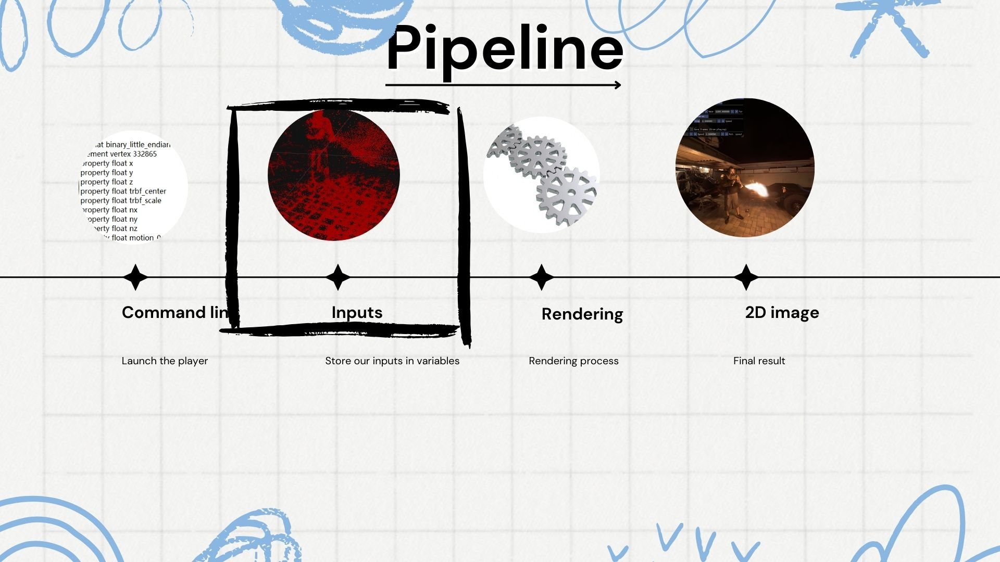

# SIBR Project

## Introduction

### 导言

The SIBR project consists of more than 246 files and is structured into several main modules, as illustrated in the architecture diagram below.

SIBR 项目包含超过 246 个文件，结构划分为多个主要模块，如下方的架构图所示。

---

## Project Structure

### system

The `core/system` module contains tools related to the operating system, such as system files and file manipulation tools. It also includes a configuration file (`Config.hpp`) that defines several useful macros and settings.

`core/system` 模块包含与操作系统相关的工具，如系统文件和文件操作工具。它还包括一个配置文件（`Config.hpp`），该文件定义了许多有用的宏和设置。

### graphics

The `core/graphics` module encompasses elements related to graphics, including images, textures, and render targets. It uses OpenCV for image management and operations. Note that `sibr::Image` encapsulates `cv::Mat` to handle images.

`core/graphics` 模块涵盖与图形相关的元素，包括图像、纹理和渲染目标。它使用 OpenCV 进行图像管理和操作。请注意，`sibr::Image` 封装了 `cv::Mat` 用于处理图像。

### assets

The `core/assets` module manages basic resources for IBR rendering. These resources are essential for loading and reading various types of data files.

`core/assets` 模块管理 IBR 渲染的基本资源。这些资源对于加载和读取各种类型的数据文件至关重要。

### scene

The `core/scene` module represents IBR scenes, allowing for the management and storage of complex data. A notable example is `sibr::BasicIBRScene`, which initializes the necessary components for scenes.

`core/scene` 模块表示 IBR 场景，允许管理和存储复杂的数据。一个显著的例子是 `sibr::BasicIBRScene`，它初始化了场景所需的组件。

### raycaster

The `core/raycaster` module provides tools for managing rays and performing intersection tests, leveraging the Embree library for fast execution.

`core/raycaster` 模块提供了用于管理射线和执行相交测试的工具，利用 Embree 库实现快速执行。

### imgproc

The `core/imgproc` module is dedicated to basic image processing, with OpenCV support for more complex tasks.

`core/imgproc` 模块专注于基本的图像处理，支持使用 OpenCV 进行更复杂的任务。

### video

The `core/video` module handles video loading and processing, relying on ffmpeg internally.

`core/video` 模块处理视频的加载和处理，内部依赖于 ffmpeg。

### view

The `core/view` module provides tools for visual scene rendering, with a basic user interface and interactive camera modes.

`core/view` 模块提供了用于视觉场景渲染的工具，具有基本的用户界面和交互式摄像机模式。

### renderer

The `core/renderer` module encapsulates rendering functionalities for IBR applications, offering a simple interface for graphic display.

`core/renderer` 模块封装了 IBR 应用程序的渲染功能，提供了一个简单的图形显示接口。

---

## Rendering Pipeline

The rendering pipeline in SIBR is broken down into several stages:

SIBR 中的渲染管道分为几个阶段：

1. **Command line (命令行)**: Launching the player from the command line.
2. **Inputs (输入)**: Storing the inputs into variables for later use.
3. **Rendering (渲染过程)**: The rendering process based on the provided inputs.
4. **2D image (二维图像)**: Producing the final 2D image as the result of the rendering.
   

1. **Command line (命令行)**：从命令行启动播放器。
2. **Inputs (输入)**：将输入存储到变量中以供以后使用。
3. **Rendering (渲染过程)**：基于提供的输入进行渲染过程。
4. **2D image (二维图像)**：生成最终的二维图像作为渲染的结果。

---

## Project Structure (continued)

### Files

The SIBR project involves several key files and directories that structure the data and configuration needed for the rendering process.

SIBR 项目包含几个关键文件和目录，这些文件和目录构成了渲染过程所需的数据和配置。

- **point_cloud**: Contains the point cloud data used for rendering.
  - **cameras**: Directory storing camera configuration files.
  - **cfg_args**: Configuration arguments for the rendering process.
  - **input**: Directory holding input files for the rendering pipeline.

  **point_cloud**: 包含用于渲染的点云数据。
  - **cameras**: 存储相机配置文件的目录。
  - **cfg_args**: 渲染过程的配置参数。
  - **input**: 保存渲染管道输入文件的目录。

---

## Rendering Pipeline (continued)

The rendering pipeline further involves the following stages:

渲染管道还包括以下阶段：

1. **Command line (命令行)**:
   - Path of our folder: 文件夹的路径
   - Store command line in a variable: 将命令行存储在变量中
   - Set different options: 设置不同的选项
   - Store point cloud path in variable: 在变量中存储点云的路径

## Command Line (continued)

Further details on using the command line in SIBR:

有关在 SIBR 中使用命令行的更多详细信息：

1. **Command line (命令行)**:
   - Path of our folder: 文件夹的路径
   - Store command line in a variable: 将命令行存储在变量中
   - Set different options: 设置不同的选项
   - Store point cloud path in variable: 在变量中存储点云的路径

---

## Rendering Pipeline (continued)

The rendering pipeline further involves the following stages:

渲染管道还包括以下阶段：

1. **Inputs (输入)**：将输入存储到变量中以供以后使用。

---
## Load the Files (continued)

This stage of the pipeline involves creating the scene and loading the necessary files.

这一阶段涉及创建场景和加载必要的文件。

1. **Create the scene (创建场景)**:
   - Create the mesh (in proxy) with `input.ply`: 使用 `input.ply` 创建网格（代理中）

2. **Gaussian View (高斯视图)**:
   - Create the ULR view and store the `point_cloud.ply` in variables: 创建 ULR 视图并在变量中存储 `point_cloud.ply`

---

## Rendering Pipeline (continued)

The rendering pipeline further involves the following stages:

渲染管道还包括以下阶段：

1. **Rendering (渲染过程)**：基于提供的输入进行渲染过程。

---

## Rendering Process (continued)

This section outlines the detailed steps involved in the rendering process, including various operations such as checking the render mode, converting view and projection matrices, and handling CUDA operations.

此部分概述了渲染过程中涉及的详细步骤，包括检查渲染模式、转换视图和投影矩阵以及处理 CUDA 操作。

1. **Render Mode Check (渲染模式检查)**:
   - If the current mode is "Ellipsoids," the `gaussianRenderer->process` method is called to process the ellipsoids.
   - If the current mode is "Initial Points," the `pointbasedrenderer->process` method is called to process the initial points.

2. **Conversion of View and Projection Matrices (视图和投影矩阵的转换)**:
   - Convert the view and projection to the target coordinate system.

3. **Calculation of Additional View Parameters (附加视图参数的计算)**:
   - Compute additional view parameters like `tan_fovy` and `tan_fovx`.

4. **Copy Frame-Dependent Data to GPU (将帧相关数据复制到 GPU)**:
   - Copy necessary data like view and projection matrices to GPU memory.

5. **Mapping of the OpenGL Resource for use with CUDA (映射 OpenGL 资源，以便与 CUDA 配合使用)**:
   - Map the OpenGL resource to make it accessible for CUDA operations.

6. **Rasterization (光栅化)**:
   - Rasterize Gaussian splats into `image_cuda`.

7. **Unmapping the OpenGL Resource for use with OpenGL (取消映射 OpenGL 资源，以便与 OpenGL 配合使用)**:
   - Unmap the OpenGL resource, making it available for use with OpenGL.

8. **Copy Image Content to Framebuffer (将图像内容复制到帧缓冲区)**:
   - Copy the final image data to the framebuffer for display.

9. **CUDA Error Handling (CUDA 错误处理)**:
   - Manage any potential errors that occur during CUDA operations.

----

## Scaffold Differences (差异)

This section introduces the differences related to the scaffold in the SIBR project. The term "scaffold" here refers to the structure or framework used to organize and process the rendering data.

本节介绍了 SIBR 项目中与脚手架相关的差异。这里的“脚手架”一词是指用于组织和处理渲染数据的结构或框架。

---

## Differences in Scaffold (差异)

This section highlights the differences between the original setup and the scaffold setup in the SIBR project, particularly focusing on the `point_cloud` and `cfg_args` files.

本节重点介绍了 SIBR 项目中原始设置与脚手架设置之间的差异，特别是 `point_cloud` 和 `cfg_args` 文件的差异。

- **Original (原始)**:
  - The original `point_cloud` file contains various properties like vertex positions, normal vectors, and colors.
  - The `cfg_args` file in the original setup specifies paths, resolution, and other rendering parameters.

- **Scaffold (脚手架)**:
  - The scaffold `point_cloud` file includes additional properties such as offsets and anchor features.
  - The `cfg_args` file in the scaffold setup includes more complex parameters, allowing for additional customization in the rendering process.

## Differences in `main.cpp` (差异)

This section highlights the differences in the `main.cpp` file between the original and scaffold setups in the SIBR project.

本节重点介绍了 SIBR 项目中 `main.cpp` 文件在原始设置和脚手架设置之间的差异。

- **Original (原始)**:
  - The original code handles basic configuration arguments like `source_path`, `sh_degree`, and `white_background`.
  - The creation of the ULR view is straightforward, without additional parameters.

- **Scaffold (脚手架)**:
  - The scaffold version includes additional configuration arguments such as `add_opacity_dist`, `add_cov_dist`, and `add_color_dist`, allowing for more detailed customization.
  - The ULR view creation in the scaffold setup also passes additional parameters related to these new configuration options.

## Differences in `GaussianView.cpp`

### Differences in `RichPoint` and `AnchorPoint` Structs 

This section highlights the differences in the `GaussianView.cpp` file, particularly focusing on the `RichPoint` and `AnchorPoint` structs, as well as the parameter list and constructor in the original versus the scaffold version.

本节重点介绍了 `GaussianView.cpp` 文件中的差异，特别是 `RichPoint` 和 `AnchorPoint` 结构体，以及原始版本和脚手架版本中的参数列表和构造函数。

- **Original (原始)**:
  - The `RichPoint` struct includes basic properties like position, scale, and rotation.
  - The parameters and constructor are simpler, with fewer attributes.

- **Scaffold (脚手架)**:
  - The `AnchorPoint` struct introduces additional properties such as normal, offset, and features, allowing for more complex rendering.
  - The parameters and constructor are extended to include these additional properties, providing more flexibility in the rendering process.

## Differences in `onRenderIBR` Function 

### Steps Comparison in `onRenderIBR` Function

This section compares the steps involved in the `onRenderIBR` function between the original and scaffold versions in the `GaussianView.cpp` file. The scaffold version includes more detailed operations for handling and processing the Gaussian splats.

本节比较了 `GaussianView.cpp` 文件中 `onRenderIBR` 函数的原始版本和脚手架版本中的步骤。脚手架版本包括更多详细的操作，用于处理和处理高斯斑点。

- **Original (原始)**:
  - The original `onRenderIBR` function follows a straightforward process, focusing on basic operations like view matrix conversion, rasterization, and CUDA error handling.

- **Scaffold (脚手架)**:
  - The scaffold version of `onRenderIBR` adds several additional steps such as filtering visible Gaussians, computing view parameters, and calculating neural opacity, leading to a more refined and controlled rendering process.

## Differences in Submodule CUDA Functions

This section highlights the differences in the CUDA functions within the submodule used by `GaussianView.cpp`. These differences reflect modifications in how Gaussian splats are processed, particularly in the scaffold setup.

本节重点介绍了在 `GaussianView.cpp` 中使用的子模块中的 CUDA 函数的差异。这些差异反映了在脚手架设置中处理高斯斑点的修改。

### 1. Differences in `rasterize_points.h` and `ext.cpp` 

- **Original (原始)**:
  - The original implementation provides basic CUDA functions for rasterizing Gaussian points.

- **Scaffold (脚手架)**:
  - The scaffold version introduces additional parameters and functions, providing more control over the rasterization process, including handling of pre-filtered data and debugging options.

### 2. Differences in `__init__.py` and `forward.cu` 

- **Original (原始)**:
  - The original code does not include advanced filtering or preprocessing steps for Gaussian points.

- **Scaffold (脚手架)**:
  - The scaffold version adds significant preprocessing and filtering steps in the CUDA code, which are integrated into the Python interface through the `__init__.py` file.

### 3. Differences in `rasterizer_impl.cu` and Directory Structure 

- **Original (原始)**:
  - The directory structure and CUDA implementation files are simpler, focusing on core rasterization tasks.

- **Scaffold (脚手架)**:
  - The scaffold setup introduces a more complex directory structure with additional files for handling different aspects of Gaussian splat rasterization, such as backward propagation and reweighted sampling.

---

### Additional Resources

For a deeper understanding of CUDA programming, please refer to the included tutorial PDF:

[CUDA Tutorial PDF](reduction-cuda.pdf)

请参阅所附的 CUDA 教程 PDF 以更深入地了解 CUDA 编程：

[CUDA 教程 PDF](reduction-cuda.pdf)

---
## Differences in Spacetime Method

This section covers the differences when using the Spacetime method, which allows rendering in 4D by incorporating the dimension of time. This method provides enhanced capabilities for dynamic scenes.

本节介绍了使用 Spacetime 方法时的差异，该方法通过加入时间维度来实现 4D 渲染。该方法为动态场景提供了更强的渲染能力。

### 1. Differences in File Structures 

- **Original (原始)**:
  - The original file structure includes basic elements like `point_cloud`, `cameras`, and `cfg_args`, with configurations tailored for static scene rendering.

- **Spacetime (Spacetime)**:
  - The Spacetime version modifies the `cfg_args` and `point_cloud` structures to handle motion data and other dynamic scene elements, enabling the system to process time-variant inputs.

### 2. Differences in Configuration Arguments

- **Original (原始)**:
  - The original `cfg_args` is configured for a standard 3D scene, with basic options set for static rendering.

- **Spacetime (Spacetime)**:
  - The Spacetime configuration introduces new parameters such as `data_device`, `loader`, and `model_path`, specifically designed to manage 4D data, including motion vectors and temporal resolution adjustments.

### 3. Differences GaussianView.hpp

- **Original (原始)**:

- **Spacetime (Spacetime)**:

### 4. Differences GaussianView.cpp

- **Original (原始)**:

- **Spacetime (Spacetime)**:

## Differences: onRenderIBR Function

The `onRenderIBR` function differs between the original implementation and the Spacetime implementation. The steps in each version are outlined below:

`onRenderIBR` 函数在原始实现和Spacetime实现之间存在差异。每个版本的步骤如下：

### Original Implementation (原始实现)

1. Render Mode Check (渲染模式检查)
2. Conversion of View and Projection Matrices (视图和投影矩阵的转换)
3. Calculation of Additional View Parameters (附加视图参数的计算)
4. Copy Frame-Dependent Data to GPU (将帧相关数据复制到GPU)
5. Mapping of the OpenGL Resource for Use with CUDA (映射OpenGL资源，以便与CUDA配合使用)
6. Rasterization (光栅化)
7. Unmapping the OpenGL Resource for Use with OpenGL (取消映射OpenGL资源，以便与OpenGL.NET资源一起使用)
8. Copy Image Content to Framebuffer (将图像内容复制到帧缓冲区)
9. CUDA Error Handling (CUDA错误处理)

### Spacetime Implementation (Spacetime实现)

1. Rendering Mode Verification (渲染模式验证)
2. Conversion of View and Projection Matrices (转换视图和投影矩阵)
3. Calculation of Additional View Parameters (计算其他视图参数)
4. Copying Frame-Dependent Data to GPU (将帧相关数据复制到GPU)
5. Mapping OpenGL Resource for Use with CUDA (映射OpenGL资源，以便与CUDA配合使用)
6. Rasterization (栅格化)
7. **Video Time Management (视频时间管理)**
8. **CUDA Rasterizer Call (CUDA光栅调用)**
9. Unmapping OpenGL Resource for Use with OpenGL (取消映射OpenGL资源，以便与OpenGL.NET资源一起使用)
10. Copying Image Content to the Framebuffer (将图像内容复制到帧缓冲区)
11. CUDA Error Management (CUDA错误管理)

## Differences in Submodule Folder: GPU-Accelerated Calculations

The submodule folder contains the `.cu` files, which enable fast calculations using the GPU. Below are the differences observed between the Original and Spacetime implementations.

`submodule` 文件夹包含 `.cu` 文件，这些文件使用 GPU 进行快速计算。以下是原始实现和 Spacetime 实现之间的差异。

### Original Implementation (原始实现)

- The folder contains various `.cu` files such as `forward.cu`, `backward.cu`, `rasterizer_impl.cu`, and their corresponding headers like `forward.h`, `backward.h`, and `rasterizer.h`.
- The structure shows the organization of these files, with each `.cu` file responsible for specific GPU-accelerated tasks.

### Spacetime Implementation (Spacetime实现)

- The structure is similar to the original but includes modifications that are likely optimized for Spacetime-specific calculations.
- The `.cu` files and headers are present, but there might be changes in how these files are used or in their content, to handle the 4D rendering tasks.

---

### Additional Resources

For a deeper understanding of CUDA programming, please refer to the included tutorial PDF:

[CUDA Tutorial PDF](reduction-cuda.pdf)

请参阅所附的 CUDA 教程 PDF 以更深入地了解 CUDA 编程：

[CUDA 教程 PDF](reduction-cuda.pdf)

---

## Conclusion: Files to Modify for Scaffold and/or Spacetime

### 1. **main.cpp**: 
   - **Purpose**: For the config argument (`cfg_arg`) if needed.
   - **Method**: Spacetime and/or Scaffold

### 2. **GaussianView.cpp**:
   - **Purpose**: Modifications in `loadPLY` and `onRenderIBR`.
   - **Method**: Spacetime and Scaffold

### 3. **backward_reweighted.cu**, **forward_reweighted.cu**:
   - **Purpose**: Add new files in `submodules\diff-gaussian-rasterization\cuda_rasterizer\`.
   - **Method**: Scaffold

### 4. **forward.cu**, **rasterize_impl.cu**:
   - **Purpose**: Modify files in `submodules\diff-gaussian-rasterization\cuda_rasterizer\`.
   - **Method**: Spacetime and Scaffold

### 5. **rasterize_point.cu**:
   - **Purpose**: Modify files in `submodules\diff-gaussian-rasterization\`.
   - **Method**: Scaffold

